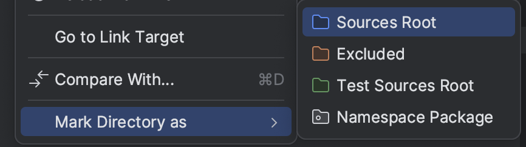

# Micropython project skeleton
This is a simple, skeleton application for MicroPython application. This skeleton uses [mpy-cli](https://github.com/1biot/mpy-cli) tool

## Installation
First step is cloning the repository.
```commandline
git clone https://github.com/1biot/mpy-project.git my-new-project
cd my-new-project
```
Now install submodules
```commandline
git submodule update --init --recursive
```

## Tree structure
```
PROJECT
|-- .vscode
|   |-- .env
|   |-- extensions.json
|   |-- settings.json
|-- docs
|-- src
|   |-- main.py
|-- tools
|   |-- mpy-cli
|   |   |-- connect.sh
|   |   |-- device.sh
|   |   |-- env.sh
|-- .mpy.json
|-- README.md
```

### .vscode
Basic config of micropython environment for Visual Studio Code.

### docs
Folder for your application documentation

### src
Source library of your project.  

### tools
Including [**mpy-cli**](https://github.com/1biot/mpy-cli) tool for creating project environment, connecting to the device and uploading files to the board.

## Prepare your environment

### Config file
Main config file is .mpy.json
```json
{
    "name": "PROJECT", // your project name
    "device": "esp32", // micropython porting device
    "micropython_version": "1.19.1", // micropython version
    "address": "/dev/tty.SLAB_USBtoUART", // device address
    "delay": 2, // delay for fixing bug with Ampy and MacOS
    "include": [
        "src"
    ]
}
```

### Environment
We need to initialize our project python environment.
```commandline
source ./tools/mpy-cli/env.sh init
```

### IDE's

#### PyCharm
Mark your directory `src` as Sources Root. If you have `src/lib` directory you need to mark as Sources Root too.



#### Visual Studio Code
Everything is done. When you open the project after creating environment everything will ready.

## Uploading your code to the device

We are using Ampy and mpy-cli provides all functionality of that module. See

```commandline
./tools/mpy-cli/device.sh --help
```

### Upload all
Upload all files and directories from `.mpy.json`

```commandline
./tools/mpy-cli/device.sh upload
```

### Upload single file

```commandline
./tools/mpy-cli/device.sh put src/main.py main.py
```

### Upload folder

```commandline
./tools/mpy-cli/device.sh put src/lib lib
```

### List files

```commandline
./tools/mpy-cli/device.sh ls
```

### List files at folder

```commandline
./tools/mpy-cli/device.sh ls lib
```

### Remove file

```commandline
./tools/mpy-cli/device.sh rm boot.py
```

### Remove folder

```commandline
./tools/mpy-cli/device.sh rmdir lib
```

## Connecting to the device
It is easy to connect to your device. Just type
```commandline
./tools/mpy-cli/connect.sh
```
```
Connected to MicroPython at /dev/tty.SLAB_USBtoUART
Use Ctrl-] to exit this shell
 8 2016 00:[aa][ba]j

rst:0x1 (POWERON_RESET),boot:0x13 (SPI_FAST_FLASH_BOOT)
configsip: 0, SPIWP:0xee
clk_drv:0x00,q_drv:0x00,d_drv:0x00,cs0_drv:0x00,hd_drv:0x00,wp_drv:0x00
mode:DIO, clock div:2
load:0x3fff0030,len:4540
ho 0 tail 12 room 4
load:0x40078000,len:12448
load:0x40080400,len:4124
entry 0x40080680 
MicroPython v1.19.1 on 2022-06-18; 4MB/OTA module with ESP32
Type "help()" for more information.
>>>
```